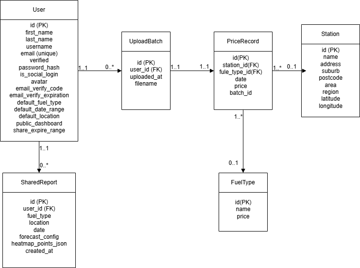

# Fuel Price Analysis Web App

The group project for unit CITS5505 agile web development


## Security Features

### CSRF Protection

The application uses Flask-WTF for CSRF (Cross-Site Request Forgery) protection

## Database Schema


## Setup and Installation

### Prerequisites

- Python 3.9 or newer
- pip (Python package installer)

### Manual Setup

please follow these steps manually to ensure the application runs correctly:

1. **Activate the virtual environment:**

   - macOS/Linux:

     ```bash
     source .venv/bin/activate
     ```

     or

     ```bash
     source venv/bin/activate
     ```

   - Windows (Command Prompt):

     ```cmd
     venv\Scripts\activate.bat
     ```

   - Windows (PowerShell):

     ```powershell
     venv\Scripts\Activate.ps1
     ```

2. **Install required packages:**

   ```bash
   pip install -r requirements.txt
   ```

3. **Set environment variables:**

   - For development:

     ```bash
     export FLASK_ENV=development
     export FLASK_APP=run.py
     export $(cat .env.development | xargs)
     ```

   - For production:

     ```bash
     export FLASK_ENV=production
     export FLASK_APP=run.py
     export $(cat .env.production | xargs)
     ```

4. **Run database migrations:**

   ```bash
   flask db init       # Only if 'migrations/' does not exist
   flask db migrate -m "Auto migration"
   flask db upgrade
   ```

5. **Run the application:**

   ```bash
   flask run
   ```

---

**Tip**: To avoid forgetting steps, we recommend using the `./start` script — it automates everything for you.

---

### Auto running setup

#### Setup

1. **Create a virtual environment (if you haven't yet):**

   ```bash
   python -m venv venv
   ```

   Or if you're using macOS or naming conventions for mac:

   ```bash
   python -m venv .venv
   ```

2. **Install dependencies:**

   The script will automatically install the packages from `requirements.txt`.

#### Usage

Run the following command from the project root directory:

```bash
./start dev
```

or

```bash
./start prod
```

- `dev` will:

  - Activate the virtual environment
  - Load environment variables from `.env.development`
  - Set `FLASK_ENV=development`
  - Apply database migrations
  - Start the Flask development server

- `prod` will:

  - Load `.env.production` instead
  - Set `FLASK_ENV=production`

#### Notes

- If your environment file is missing (e.g., `.env.development` or `.env.production`), the script will stop with an error.
- If no `migrations/` folder exists, it will auto-initialize one with `flask db init`.
- You can customize the startup behavior by editing `start` directly.
- The script is designed to be cross-platform compatible (Windows/macOS/Linux).

#### Troubleshooting

- **Activation failed?**
  Make sure you're using a shell that supports sourcing (`source` command), like Bash or Zsh.
- **Environment not loading?**
  Check that `.env.development` or `.env.production` exists and is correctly formatted (`KEY=value` per line).
- **Permission denied?**
  If the script is not executable, run:

  ```bash
  chmod +x start
  ```

---

### Running Tests

To run the test suite:

```bash
./test
```

## Members

| UWA ID   |      Name       |                               Github user name |
| :------- | :-------------: | ---------------------------------------------: |
| 24386873 |   Edward Yuan   | [@Seikasahara](https://github.com/Seikasahara) |
| 24638832 |   Parna Basak   |   [@parnabasak](https://github.com/parnabasak) |
| 24146595 |   Yechang Wu    |           [@Wycers](https://github.com/wycers) |
| 24349497 | Zhengdong Jiang |             [@dgyz8](https://github.com/dgyz8) |
