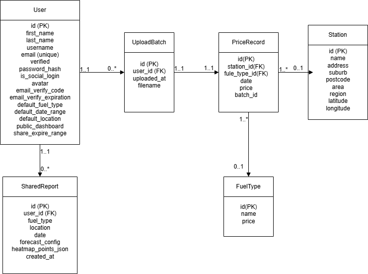

# Fuel Price Analysis Web App

The group project for unit CITS5505 agile web development


## Project Structure

### 📁 Project Directory Overview

```
Agile-Web-App/
├── app/                    # Main Flask application
│   ├── __init__.py
│   ├── models.py
│   ├── routes/
│   │   ├── auth.py
│   │   ├── dashboard.py
│   │   └── main.py
│   ├── templates/
│   │   ├── base.html
│   │   └── main/
|   |       ├── dashboard.html
|   |       ├── profile.html
│   │       ├── index.html
│   │       ├── login.html
│   │       ├── signup.html
│   │       └── reset_password.html
│   └── static/
│       ├── css/
│       │   └── style.css
│       ├── js/
│       └── assets/
├── migrations/             # Database migration files
├── tests/                  # Test suite
├── .github/                # GitHub Actions & issue templates
├── .vscode/                # Editor configuration
├── run.py                  # App entry point
├── config.py               # App configuration
├── requirements.txt        # Dependencies
├── .env.development        # Local environment variables
├── .env.production         # Local environment variables
└── README.md               # Project documentation
```

### Key Directories and Files

#### Application Code (`app/`)

- `__init__.py`: Creates and configures the Flask application
- `models.py`: Database models (currently empty)
- `routes/`: Contains all route handlers
  - `main.py`: Handles main application routes
- `templates/`: HTML templates using Jinja2
  - `base.html`: Base template with common layout
  - `main/`: Templates for main application pages
- `static/`: Static assets (CSS, JS, images)
  - `css/`: Stylesheets
    - `style.css`: Main application styles

#### Testing (`tests/`)

- `test_main.py`: Unit tests for main application routes
- `__init__.py`: Makes tests a Python package

#### Configuration

- `config.py`: Application configuration settings
- `requirements.txt`: Python package dependencies
- `run.py`: Entry point for running the application

#### Development Tools

- `.github/`: GitHub Actions workflows and templates
- `.vscode/`: VS Code workspace settings
- `.venv/`: Python virtual environment

## Database Structure

### 1. Field Description Table
#### User
| Attribute                 | Type/Length  | PK | FK | Nullable | Description           |
| ------------------------- | ------------ | -- | -- | -------- | --------------------- |
| id                        | Integer      | ✔  |    | No       | User ID (Primary Key) |
| first\_name               | String(30)   |    |    | No       | First name            |
| last\_name                | String(30)   |    |    | No       | Last name             |
| username                  | String(80)   |    |    | No       | Display username      |
| email                     | String(120)  |    |    | No       | Email (Unique)        |
| verified                  | Boolean      |    |    | No       | Is email verified     |
| password\_hash            | String(128)  |    |    | No       | Hashed password       |
| is\_social\_login         | Boolean      |    |    | Yes      | Social login status   |
| avatar                    | String(256)  |    |    | Yes      | Avatar path           |
| email\_verify\_code       | String(6)    |    |    | Yes      | Email code            |
| email\_verify\_expiration | DateTime     |    |    | Yes      | Email code expiry     |
| default\_fuel\_type       | String(32)   |    |    | Yes      | Default fuel type     |
| default\_date\_range      | String(16)   |    |    | Yes      | Default date range    |
| default\_location         | String(64)   |    |    | Yes      | Default location      |
| public\_dashboard         | Boolean      |    |    | Yes      | Public dashboard      |
| share\_expire\_range      | String(16)   |    |    | Yes      | Share expire range    |
| uploads                   | relationship |    |    |          | \[UploadBatch] 1\:N   |
| shared\_reports           | relationship |    |    |          | \[SharedReport] 1\:N  |


#### UploadBatch
| Attribute    | Type/Length  | PK | FK | Nullable | Description            |
| ------------ | ------------ | -- | -- | -------- | ---------------------- |
| id           | Integer      | ✔  |    | No       | Batch ID (Primary Key) |
| user\_id     | Integer      |    | ✔  | No       | User (Foreign Key)     |
| uploaded\_at | DateTime     |    |    | No       | Upload time            |
| filename     | String(200)  |    |    | Yes      | Source file name       |
| prices       | relationship |    |    |          | \[PriceRecord] 1\:N    |


#### Station
| Attribute | Type/Length  | PK | FK | Nullable | Description              |
| --------- | ------------ | -- | -- | -------- | ------------------------ |
| id        | Integer      | ✔  |    | No       | Station ID (Primary Key) |
| name      | String(100)  |    |    | No       | Station name             |
| address   | String(200)  |    |    | No       | Address                  |
| suburb    | String(100)  |    |    | Yes      | Suburb                   |
| postcode  | String(20)   |    |    | Yes      | Postal code              |
| area      | String(100)  |    |    | Yes      | Area                     |
| region    | String(100)  |    |    | Yes      | Region                   |
| latitude  | Float        |    |    | Yes      | Latitude                 |
| longitude | Float        |    |    | Yes      | Longitude                |
| prices    | relationship |    |    |          | \[PriceRecord] 1\:N      |


#### FuelType
| Attribute | Type/Length  | PK | FK | Nullable | Description                |
| --------- | ------------ | -- | -- | -------- | -------------------------- |
| id        | Integer      | ✔  |    | No       | Fuel type ID (Primary Key) |
| name      | String(50)   |    |    | No       | Name (unique)              |
| prices    | relationship |    |    |          | \[PriceRecord] 1\:N        |


#### PriceRecord
| Attribute      | Type/Length | PK | FK | Nullable | Description                   |
| -------------- | ----------- | -- | -- | -------- | ----------------------------- |
| id             | Integer     | ✔  |    | No       | Price record ID (Primary Key) |
| station\_id    | Integer     |    | ✔  | No       | Station (Foreign Key)         |
| fuel\_type\_id | Integer     |    | ✔  | No       | FuelType (Foreign Key)        |
| date           | Date        |    |    | No       | Date of the price             |
| price          | Float       |    |    | No       | Fuel price                    |
| batch\_id      | Integer     |    | ✔  | No       | UploadBatch (Foreign Key)     |


#### SharedReport
| Attribute             | Type/Length | PK | FK | Nullable | Description            |
| --------------------- | ----------- | -- | -- | -------- | ---------------------- |
| id                    | Integer     | ✔  |    | No       | Shared report ID       |
| user\_id              | Integer     |    | ✔  | Yes      | User (Foreign Key)     |
| fuel\_type            | String(50)  |    |    | Yes      | Fuel type              |
| location              | String(50)  |    |    | Yes      | Location               |
| date                  | String(10)  |    |    | Yes      | Date                   |
| forecast\_config      | Text        |    |    | Yes      | Forecast config (JSON) |
| heatmap\_points\_json | Text        |    |    | Yes      | Heatmap data (JSON)    |
| created\_at           | DateTime    |    |    | Yes      | Creation time          |

#### Summary Table
| Table        | Field          | Relationship                  | Related Table | Relationship Description               |
| ------------ | -------------- | ----------------------------- | ------------- | -------------------------------------- |
| UploadBatch  | user\_id       | ForeignKey                    | User          | Each upload batch is linked to a user  |
| UploadBatch  | prices         | relationship(back\_populates) | PriceRecord   | Batch has many price records           |
| PriceRecord  | batch\_id      | ForeignKey                    | UploadBatch   | Each price record comes from a batch   |
| PriceRecord  | station\_id    | ForeignKey                    | Station       | Each price record belongs to a station |
| PriceRecord  | fuel\_type\_id | ForeignKey                    | FuelType      | Each price record has a fuel type      |
| Station      | prices         | relationship(back\_populates) | PriceRecord   | Station has many price records         |
| FuelType     | prices         | relationship(back\_populates) | PriceRecord   | FuelType has many price records        |
| User         | uploads        | relationship(back\_populates) | UploadBatch   | User has many uploads                  |
| SharedReport | user\_id       | ForeignKey                    | User          | Shared report belongs to a user        |

#### Database Schema


## Security Features

### CSRF Protection

The application uses Flask-WTF for CSRF (Cross-Site Request Forgery) protection:

- All forms include a CSRF token via the `{{ csrf_field() }}` template macro
- AJAX requests automatically include the CSRF token in the header
- Protection is enabled globally in `app/__init__.py`
- Custom error handlers gracefully handle CSRF validation errors

To use CSRF protection in forms:

1. Include the CSRF token in HTML forms:
   ```html
   <form method="post">
     {{ csrf_field() }}
     <!-- Form fields -->
   </form>
   ```

2. For AJAX requests, the token is automatically included from the metadata:
   ```html
   <meta name="csrf-token" content="{{ csrf_token() }}">
   ```

## Setup and Installation

### Prerequisites

- Python 3.9 or newer
- pip (Python package installer)

### Setting up Virtual Environment

1. Create a virtual environment:

   ```bash
   python -m venv .venv
   ```

2. Activate the virtual environment:

   - On macOS/Linux:
     ```bash
     source .venv/bin/activate
     ```
   - On Windows:
     ```bash
     .venv\Scripts\activate
     ```

3. Install required packages:
   ```bash
   pip install -r requirements.txt
   ```

### Running the Application

To start the project, use `start.sh`, [dev] means development branch. [prod] means production branch

The application will be available at `http://localhost:5000`

### Running Tests

To run the test suite:

```bash
pytest
```

## Members

| UWA ID   |      Name       |                               Github user name |
| :------- | :-------------: | ---------------------------------------------: |
| 24386873 |   Edward Yuan   | [@Seikasahara](https://github.com/Seikasahara) |
| 24638832 |   Parna Basak   |   [@parnabasak](https://github.com/parnabasak) |
| 24146595 |   Yechang Wu    |           [@Wycers](https://github.com/wycers) |
| 24349497 | Zhengdong Jiang |             [@dgyz8](https://github.com/dgyz8) |
